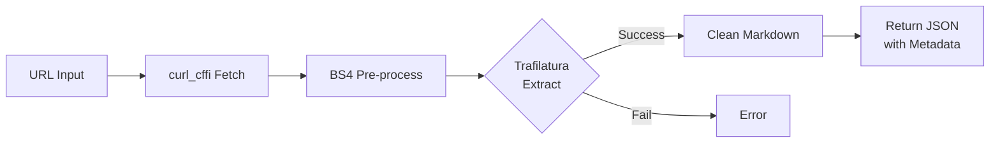

# AI Web Scraper

A robust web scraper that extracts webpage content as clean **Markdown**, served via a FastAPI backend with a real-time streaming web UI.

## Features

- **Real-time Web UI** — Custom HTML/CSS/JS dashboard powered by FastAPI and Server-Sent Events (SSE) for live progress updates
- **Smart content extraction** — Trafilatura-first with BeautifulSoup pre-processing for maximum coverage
- **Anti-bot bypass** — Uses `curl_cffi` to impersonate real browsers (Chrome TLS fingerprint)
- **Retry with backoff** — Automatic retries with exponential backoff on failed requests
- **Markdown output** — Clean Markdown with title, source URL, and extracted content
- **Rich metadata** — Returns author, date, description, site name, language, word count, and Open Graph image alongside content
- **Batch scraping** — Scrape multiple URLs from a text file or the web UI
- **Sitemap support** — Extract URLs from XML sitemaps (including sitemap indexes) with recursive resolution
- **URL validation** — Validates all URLs before attempting to fetch
- **Markdown cleanup** — Fixes header levels, merges broken definition lists, and removes empty bullets from Trafilatura output

## Installation

Requires **Python 3.12+** and [uv](https://docs.astral.sh/uv/).

```bash
# Clone the repository
git clone https://github.com/SouravKAgarwal/web-scraper.git
cd web-scraper

# Install dependencies
uv sync
```

## Usage

### Web UI (Recommended)

Launch the FastAPI server to use the web interface:

```bash
uvicorn server:app --host 0.0.0.0 --port 8000 --reload
```

This starts the server at `http://localhost:8000`. Open it in your browser to:

- Enter one or more URLs (one per line) or a sitemap URL
- Set an optional limit on the number of pages to scrape
- Watch real-time progress as each page is scraped
- View rendered Markdown results with syntax highlighting

### CLI Usage: Scrape a single URL

```bash
uv run main.py https://example.com/article
```

### Scrape multiple URLs from a file

```bash
uv run main.py -f urls.txt
```

The URL file should contain one URL per line. Lines starting with `#` are treated as comments and ignored.

```text
# News articles
https://example.com/article-1
https://example.com/article-2

# Blog posts
https://blog.example.com/post-1
```

### Limit the number of URLs

```bash
uv run main.py -f urls.txt -n 10
```

### Extract URLs from a sitemap

```bash
uv run scrape_sitemap.py https://example.com/sitemap.xml
```

Save extracted URLs to a file:

```bash
uv run scrape_sitemap.py https://example.com/sitemap.xml -o urls.txt
```

### Pipe sitemap URLs into the scraper

```bash
uv run scrape_sitemap.py https://example.com/sitemap.xml -o urls.txt
uv run python main.py -f urls.txt -n 20
```

## Project Structure

```
web-scraper/
├── main.py              # Core scraper — fetches, extracts, and returns structured data
├── server.py            # FastAPI server with SSE streaming API
├── scrape_sitemap.py    # Sitemap parser — extracts URLs from XML sitemaps
├── test.py              # Example client script for the /scrape API
├── static/
│   ├── index.html       # Web UI markup
│   ├── script.js        # Client-side JS (SSE handling, Markdown rendering)
│   └── style.css        # UI styles
├── pyproject.toml       # Project metadata and dependencies
├── uv.lock              # Locked dependency versions
└── .python-version      # Python version (3.12)
```

## How It Works



1. **Fetch** — Downloads the page HTML using `curl_cffi` with Chrome browser impersonation to bypass anti-bot measures. Retries up to 3 times with exponential backoff.
2. **Pre-process** — Unwraps nested tags inside `<pre>` blocks with BeautifulSoup to prevent code block fragmentation in Trafilatura's output.
3. **Extract** — Passes the cleaned HTML to Trafilatura for intelligent content extraction as Markdown (with links and images). Also extracts metadata (title, author, date, description, etc.).
4. **Clean** — Post-processes the Markdown: downgrades header levels, merges broken definition lists, and removes empty bullets.
5. **Return** — Returns structured JSON containing the Markdown content and all extracted metadata.

## API Reference

### `POST /scrape`

Streams scrape results via Server-Sent Events (SSE).

**Request body:**

```json
{
  "urls": ["https://example.com/page1", "https://example.com/page2"],
  "sitemap": false,
  "limit": 0
}
```

**Request Example:**

```py
import json

import requests

result = {}


def scrape_result(urls: list, sitemap: bool = False, limit: int = 0) -> dict:
    resp = requests.post(
        url="http://localhost:8000/scrape",
        json={"urls": urls, "sitemap": sitemap, "limit": limit},
        stream=True,
    )

    for line in resp.iter_lines(decode_unicode=True):
        if line.startswith("data:"):
            event = json.loads(line[len("data:") :])
            if event["type"] == "done":
                del event["type"]
                result.update(event)

    return result


if __name__ == "__main__":
    urls =  ["https://example.com/page1", "https://example.com/page2"]
    limit = 2

    result = scrape_result(urls, limit)
    print(json.dumps(result, indent=4))


```

| Field     | Type        | Description                                                    |
| --------- | ----------- | -------------------------------------------------------------- |
| `urls`    | `list[str]` | URLs to scrape, or a single sitemap URL if `sitemap` is `true` |
| `sitemap` | `bool`      | Treat the first URL as a sitemap and extract URLs from it      |
| `limit`   | `int`       | Max URLs to scrape (`0` = unlimited)                           |

**SSE event types:**

| `type`     | Description                                                      |
| ---------- | ---------------------------------------------------------------- |
| `progress` | Sent before scraping each URL (`current`, `total`, `url`)        |
| `result`   | Scraped data for one URL (or error)                              |
| `info`     | Informational messages (e.g., sitemap extraction count)          |
| `done`     | Final summary (`successful`, `failed`, `total`, `response_time`) |
| `error`    | Fatal error (e.g., no valid URLs)                                |

## CLI Reference

### `main.py`

| Flag            | Description                         | Default   |
| --------------- | ----------------------------------- | --------- |
| `url`           | A single URL to scrape (positional) | —         |
| `-f`, `--file`  | Text file with URLs (one per line)  | —         |
| `-n`, `--limit` | Max number of URLs to scrape        | Unlimited |

> If no URL or file is provided, prompts for manual input.

Output is printed as JSON to stdout.

### `scrape_sitemap.py`

| Flag             | Description                 | Default |
| ---------------- | --------------------------- | ------- |
| `sitemap_url`    | Sitemap URL (positional)    | —       |
| `-o`, `--output` | Save extracted URLs to file | stdout  |

## Dependencies

| Package                                                    | Purpose                                    |
| ---------------------------------------------------------- | ------------------------------------------ |
| [trafilatura](https://pypi.org/project/trafilatura/)       | Intelligent web content extraction         |
| [beautifulsoup4](https://pypi.org/project/beautifulsoup4/) | HTML pre-processing and tag cleanup        |
| [curl-cffi](https://pypi.org/project/curl-cffi/)           | HTTP client with browser TLS impersonation |
| [fastapi](https://pypi.org/project/fastapi/)               | Web framework for the API server           |
| [uvicorn](https://pypi.org/project/uvicorn/)               | ASGI server for FastAPI                    |
| [sse-starlette](https://pypi.org/project/sse-starlette/)   | Server-Sent Events support for FastAPI     |
| [requests](https://pypi.org/project/requests/)             | HTTP library (used by test client)         |

## License

MIT
