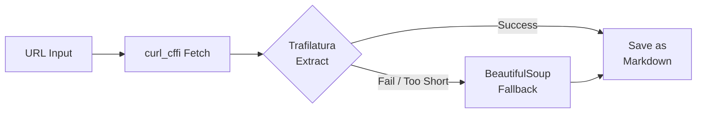

# AI Web Scraper

A robust web scraper that extracts webpage content as clean **Markdown** files.

## Features

- **Smart content extraction** — Trafilatura-first with BeautifulSoup fallback for maximum coverage
- **Anti-bot bypass** — Uses `curl_cffi` to impersonate real browsers (Chrome TLS fingerprint)
- **Retry with backoff** — Automatic retries with exponential backoff on failed requests
- **Markdown output** — Clean `.md` files with title, source URL, and extracted content
- **Batch scraping** — Scrape multiple URLs from a text file
- **Sitemap support** — Extract URLs from XML sitemaps (including sitemap indexes)
- **URL validation** — Validates all URLs before attempting to fetch
- **Collision-safe filenames** — Automatic numeric suffixes prevent file overwrites

## Installation

Requires **Python 3.12+** and [uv](https://docs.astral.sh/uv/).

```bash
# Clone the repository
git clone https://github.com/your-username/web-scraper.git
cd web-scraper

# Install dependencies
uv sync
```

## Usage

### Scrape a single URL

```bash
uv run python main.py https://example.com/article
```

### Scrape multiple URLs from a file

```bash
uv run python main.py -f urls.txt
```

The URL file should contain one URL per line. Lines starting with `#` are treated as comments and ignored.

```text
# News articles
https://example.com/article-1
https://example.com/article-2

# Blog posts
https://blog.example.com/post-1
```

### Custom output directory

```bash
uv run python main.py https://example.com -o scraped_pages
```

### Limit the number of URLs

```bash
uv run python main.py -f urls.txt -n 10
```

### Extract URLs from a sitemap

```bash
uv run python scrape_sitemap.py https://example.com/sitemap.xml
```

Save extracted URLs to a file:

```bash
uv run python scrape_sitemap.py https://example.com/sitemap.xml -o urls.txt
```

### Pipe sitemap URLs into the scraper

```bash
uv run python scrape_sitemap.py https://example.com/sitemap.xml -o urls.txt
uv run python main.py -f urls.txt -n 20
```

## Project Structure

```
web-scraper/
├── main.py              # Main scraper — fetches, extracts, and saves content
├── scrape_sitemap.py    # Sitemap parser — extracts URLs from XML sitemaps
├── urls.txt             # Sample URL list file (one URL per line)
├── pyproject.toml       # Project metadata and dependencies
├── uv.lock              # Locked dependency versions
├── .python-version      # Python version (3.12)
└── output/              # Default output directory for scraped Markdown files
```

## How It Works



1. **Fetch** — Downloads the page HTML using `curl_cffi` with Chrome browser impersonation to bypass anti-bot measures. Retries up to 3 times with exponential backoff.
2. **Extract** — Passes HTML to Trafilatura for intelligent content extraction (optimized for articles). If Trafilatura returns too little text (< 50 chars), falls back to BeautifulSoup.
3. **Save** — Writes the extracted content as a Markdown file with a metadata header (title + source URL). Filenames are slugified from the page title.

## CLI Reference

### `main.py`

| Flag | Description | Default |
|------|-------------|---------|
| `url` | A single URL to scrape (positional) | — |
| `-f`, `--file` | Text file with URLs (one per line) | — |
| `-o`, `--output` | Output directory | `output` |
| `-n`, `--limit` | Max number of URLs to scrape | Unlimited |

### `scrape_sitemap.py`

| Flag | Description | Default |
|------|-------------|---------|
| `sitemap_url` | Sitemap URL (positional) | — |
| `-o`, `--output` | Save extracted URLs to file | stdout |

## Dependencies

| Package | Purpose |
|---------|---------|
| [trafilatura](https://pypi.org/project/trafilatura/) | Intelligent web content extraction |
| [beautifulsoup4](https://pypi.org/project/beautifulsoup4/) | HTML parsing fallback |
| [curl-cffi](https://pypi.org/project/curl-cffi/) | HTTP client with browser TLS impersonation |
| [requests](https://pypi.org/project/requests/) | HTTP library (transitive dependency) |

## License

MIT
